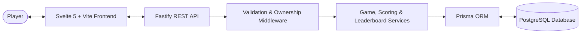

# HUE

A perceptual color-memory game where players memorize a target color swatch and reproduce it as accurately as possible from memory using Hue, Saturation, and Brightness (HSB) controls. 

Built with **Svelte + Vite** on the frontend, a server-authoritative **Node.js + Fastify** backend, and **PostgreSQL + Prisma ORM** for persistent stats, leaderboards, and scoring.

---

## 🎮 Live Demo

**Play HUE:** [https://hue-azure.vercel.app](https://hue-azure.vercel.app)  
**GitHub Repository:** [https://github.com/buvan005/Hue](https://github.com/buvan005/Hue)

---

## 📖 Overview

**HUE** tests your visual recall and color sensitivity across five quick, focused rounds.

- **The Concept**: Color perception is relative, but color memory requires precision. HUE challenges you to observe a color swatch, hold its exact shade, saturation, and luminance in your mind, and reconstruct it without a side-by-side reference.
- **The Objective**: Achieve the highest cumulative score across 5 rounds (maximum 50.0 points).
- **Player Interaction**: Players adjust interactive **Hue ($0^\circ–360^\circ$)**, **Saturation ($0\%–100\%$)**, and **Brightness ($0\%–100\%$)** sliders to match the memorized color swatch.
- **Game Structure**: Each match consists of 5 distinct rounds with procedurally generated target colors.
- **Accuracy & Scoring**: Precision is evaluated using the industry-standard **CIE76 $\Delta E$ formula in CIELAB color space**. The closer your reproduction is to human perceptual equivalence, the higher your score.

---

## ✨ Features

- **Username-Based Identity**: Instant play with case-insensitive unique usernames saved to `localStorage`—no passwords or account setup barriers required.
- **Color Memorization Stage**: A 5-second countdown window displays the target swatch before hiding it for reproduction.
- **Interactive HSB Controls**: Real-time reactive slider tracks for Hue ($0^\circ–360^\circ$), Saturation ($0\%–100\%$), and Brightness ($0\%–100\%$).
- **Five-Round Match Structure**: Progressive match state tracking 5 independent rounds from start to finish.
- **Perceptual Color Matching**: Uses the CIELAB color space and CIE76 $\Delta E$ metric for mathematically rigorous perceptual distance calculation.
- **Round-by-Round Scoring**: Each round yields a score from $0.00$ to $10.00$, paired with witty contextual feedback messages.
- **Server-Authoritative Validation**: Target swatches and scoring calculations are computed exclusively on the backend to prevent score forging or tampering.
- **Side-by-Side Comparison**: Reveals your guess alongside the actual target with numerical $\Delta E$ difference and HEX code readouts after each round.
- **Comprehensive Match Results**: Detailed end-of-game summary displaying final score out of 50, round-by-round breakdown, personal best indicators, global rank, and percentile.
- **Global & Periodic Leaderboards**: Authoritative rankings with time filters for **TODAY** (rolling 24h), **WEEK** (last 7 days), and **ALL** time.
- **Personal Best Deduplication**: Every player appears at most once on any leaderboard view with their single highest score.
- **Authoritative Tie-Breaking**: Ties between identical scores are broken by who achieved the score first (`completed_at ASC`).
- **True Percentile Calculation**: Accurate percentile reporting showing the exact percentage of unique players you outperformed.
- **Seamless "Play Again"**: Start a new game immediately with your active session without re-entering your username.
- **Replay & Ownership Protection**: Atomic database transactions prevent skipped rounds, duplicate submissions, cross-user tampering, or duplicate game completions.
- **Rate Limiting & Security Hardening**: API endpoints protected with route-specific rate limiters and strict Zod request schema validation.
- **Graceful Error Handling**: Resilient client error handling for network interruptions, with sanitized production error responses.

---

## 🕹️ Game Logic

HUE follows a strictly enforced state machine across both client and server:

```
START ──► MEMORIZE ──► GUESS ──► RESULT ──► NEXT ROUND ──► END
                                   ▲            │
                                   └────────────┘
                                  (Rounds 1 to 5)
```

### 1. Start (`START`)
- The player is prompted to enter a display username (2–20 characters, alphanumeric, underscores, and hyphens).
- Input is sanitized and validated on both frontend and backend.
- Starting a game initializes a session on the server via `POST /api/games`, generating 5 target colors and returning only the first round target.

### 2. Memorize (`MEMORIZE`)
- The target color swatch is displayed prominently in full screen for 5 seconds.
- The player studies the shade, observing hue warmth, saturation level, and luminance depth.
- Once the timer expires, the target is hidden, and the interface transitions to the Guess stage.

### 3. Guess (`GUESS`)
- The player manipulates Hue, Saturation, and Brightness sliders to reconstruct the memorized color.
- A live preview shows the current guessed color swatch in real time.
- Once satisfied, the player clicks **SUBMIT GUESS** to send their coordinates to `POST /api/games/:gameId/rounds`.

### 4. Result (`RESULT`)
- The server evaluates the guess against the hidden target, computing $\Delta E$ and round score.
- The client presents a split comparison displaying the target color, your guessed color, the perceptual distance ($\Delta E$), the round points earned, and a performance tagline.

### 5. Next Round (`NEXT ROUND`)
- Clicking **NEXT ROUND** advances the round counter.
- Steps 2 through 4 repeat for all 5 rounds. The server reveals target colors one round at a time to prevent lookahead cheating.

### 6. End (`END`)
- Upon completing Round 5, the client invokes `POST /api/games/:gameId/complete`.
- The backend verifies that all 5 rounds are completed, calculates the final score out of 50.0, marks the game as `COMPLETED`, updates personal bests, and computes the player's updated global rank and percentile.
- The player views their final result card, opens the global leaderboard modal, or clicks **PLAY AGAIN** to immediately launch a new match with their saved profile.

---

## 🎨 Color Matching & Scoring

HUE calculates color accuracy based on human visual perception rather than simple RGB Euclidean distance.

```
HSB Guess (h, s, b)
       │
       ▼
sRGB Color Space (r, g, b)
       │
       ▼
CIE XYZ (linearized gamma & D65 white point)
       │
       ▼
CIELAB (L*, a*, b*)  ◄───►  CIELAB Target (L*, a*, b*)
                                    │
                                    ▼
                         CIE76 Delta E Distance
                                    │
                                    ▼
                           Round Score (0 – 10)
```

### 1. Color Space Conversion Pipeline

1. **HSB to sRGB**: Cylindrical coordinates ($H \in [0, 360]$, $S \in [0, 100]$, $B \in [0, 100]$) are converted to standard 8-bit sRGB ($R, G, B \in [0, 255]$).
2. **sRGB to CIE XYZ**: RGB values are linearized using an inverse sRGB gamma companding curve ($n \le 0.04045 \implies n / 12.92$, else $((n + 0.055) / 1.055)^{2.4}$) and transformed to CIE XYZ using the standard D65 illuminant matrix.
3. **CIE XYZ to CIELAB**: Non-linear cube root transformations produce $L^*$ (perceptual lightness, $0–100$), $a^*$ (green–red axis), and $b^*$ (blue–yellow axis).

### 2. Perceptual Distance ($\Delta E$)

Color difference is computed using the Euclidean distance in CIELAB space (**CIE76 $\Delta E$**):

$$\Delta E = \sqrt{(\Delta L^*)^2 + (\Delta a^*)^2 + (\Delta b^*)^2}$$

- $\Delta E < 2.0$: Imperceptible to the untrained eye.
- $\Delta E \approx 5.0$: Very close match.
- $\Delta E > 50.0$: Completely different color family.

### 3. Round Score Formula

Each round awards between **0.00 and 10.00 points**, using a linear falloff bounded at $\Delta E = 100$:

$$\text{Round Score} = \begin{cases} 
10.00 & \text{if } \Delta E \le 0 \\
0.00 & \text{if } \Delta E \ge 100 \\
10 \times \left(1 - \frac{\Delta E}{100}\right) & \text{otherwise}
\end{cases}$$

Scores are rounded to two decimal places.

### 4. Final Score

The match total is the sum of the five individual round scores:

$$\text{Final Score} = \sum_{r=1}^{5} \text{Round Score}_r \quad (\text{Maximum: } 50.00)$$

---

## 🏆 Leaderboard & Ranking

HUE provides a deduplicated, server-authoritative leaderboard accessible from the start and end screens.

- **Unique Player Deduplication**: Each player appears **only once** on the leaderboard with their single highest score ($\max(\text{total\_score})$) within the filtered timeframe.
- **Authoritative Tie-Breaking**: When two players share the exact same high score, the player who achieved that score **earlier in time** (`completed_at ASC`) takes the higher rank. A deterministic user ID sort acts as the final fallback.
- **Timeframe Filters**:
  - **TODAY**: Games completed within the current 24-hour window.
  - **WEEK**: Games completed within the rolling last 7 days.
  - **ALL**: All-time high scores.
- **Pagination**: Supports paginated queries via `limit` (1–100) and `page` parameters.
- **Separation of History and Standings**: Full game histories and individual round records are preserved in the database for analytics, while the leaderboard query aggregates and ranks unique player personal bests.

---

## 📊 Player Performance

Upon completing a game or opening the dossier, players receive comprehensive analytics:

- **Personal Best**: Indicates your highest all-time 5-round score, with an active badge when a new personal record is achieved.
- **Current vs. Historical Performance**: Shows your current match score alongside your historical average score and total completed matches.
- **Global Rank**: Your exact sequential standing (e.g., `#12`) among all unique players worldwide.
- **Percentile ("Better Than")**: Mathematically computed as the percentage of unique players who hold a strictly lower personal best:

$$\text{Percentile} = \left\lfloor \frac{\text{Unique Players with Strictly Lower Best Score}}{\text{Total Unique Players}} \times 100 \right\rfloor$$

- **Average Community Score**: Benchmark your results against the global average score of all active players.

---

## 🏗️ Application Architecture



### Frontend (`/src`)
- **Framework**: Svelte 5 with Vite.
- **Styling**: Tailored CSS design system with JetBrains Mono typography, custom slider tracks, retro beige backdrop (`#EDEAE0`), and responsive macOS window chrome.
- **State Management**: Central reactive store ([`gameStore.js`](file:///c:/Users/buvan/OneDrive/Desktop/HUE/src/stores/gameStore.js)) handling game lifecycle transitions, timer intervals, local persistence, and offline fallback.
- **API Client**: Modular fetch wrapper ([`src/api/`](file:///c:/Users/buvan/OneDrive/Desktop/HUE/src/api)) communicating with the Fastify backend.

### Backend (`/backend/src`)
- **Runtime & Server**: Node.js with Fastify 5.
- **Validation**: Strict request validation using **Zod** middleware ([`validation.js`](file:///c:/Users/buvan/OneDrive/Desktop/HUE/backend/src/middleware/validation.js)) checking types, ranges, and UUIDs.
- **Security & Rate Limiting**: IP-based throttling via `@fastify/rate-limit` and dynamic CORS origin validation.
- **Services**:
  - `gameService.js`: Game lifecycle, sequential round checks, atomic state transitions, ownership verification.
  - `scoringService.js`: Target evaluation and perceptual delta math.
  - `leaderboardService.js`: Leaderboard deduplication, period filtering, and tie-breaking.
  - `statsService.js`: Player performance metrics and history aggregation.

### Database (`/backend/prisma`)
- **Engine**: PostgreSQL with Prisma ORM.
- **Models**:
  - `User`: Unique identities, normalized usernames, timestamps.
  - `Game`: Game sessions, status (`IN_PROGRESS`, `COMPLETED`, `ABANDONED`), total score, rounds completed, and completion timestamps.
  - `Round`: Individual round records, target HSB, guess HSB, score, and $\Delta E$.
- **Indexes**: Composite indexes on `[status, completed_at]` and `[status, total_score(sort: Desc)]` ensure sub-millisecond leaderboard and percentile queries.

---

## 💻 Local Development

### Prerequisites
- Node.js (v18+)
- PostgreSQL (or use the built-in local development database)

### Setup

1. **Clone the repository**:
   ```bash
   git clone https://github.com/buvan005/Hue.git
   cd Hue
   ```

2. **Setup and run the backend**:
   ```bash
   cd backend
   npm install
   cp .env.example .env
   npm run prisma:generate
   npm run prisma:migrate
   npm run dev
   ```
   *The backend runs at `http://localhost:3000`.*

3. **Setup and run the frontend**:
   ```bash
   # From the project root:
   npm install
   cp .env.example .env
   npm run dev
   ```
   *The frontend runs at `http://localhost:5173`.*

### Running Tests

```bash
# Frontend core logic tests:
npm test

# Backend API, ranking & security test suite:
cd backend
npm test
```

---

## 📄 License

MIT © [buvan005](https://github.com/buvan005)
